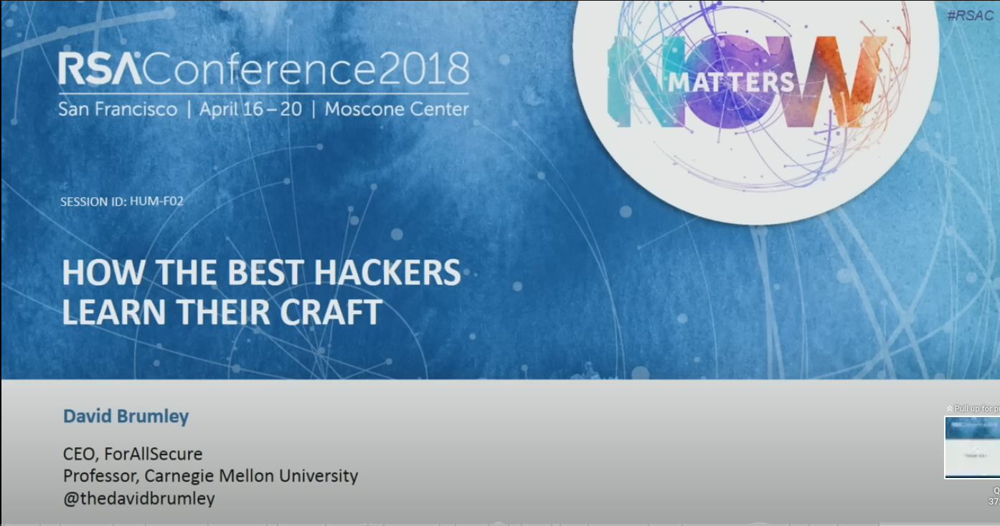
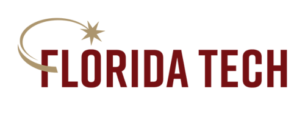
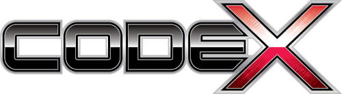

# WildcatCSClub

Repository for artifacts for helping the WildCat CS Club (formerly Cyber
Security Club), now Computer Science Club.

[Prior year challenges (with sample writeups)](past_challenges/year_2022_2023) are available. This is only a subset
of the 50 or so challenges the we worked on over the year.

[Slides from this year and prior years](slides/readme.md) are also available.

# Links to local in-person competitions

* [Lockheed Martin Code Quest Information](https://www.lockheedmartin.com/en-us/who-we-are/communities/codequest.html)
* [2023 Code Quest Pictures](https://lockheedmartin.smugmug.com/Code-Quest/Code-Quest-2023/FL-Orlando/)
* [Lockheed Martin Cyber Quest Information](https://www.lockheedmartin.com/en-us/who-we-are/communities/cyber-quest.html)
* [2023 Cyber Quest Pictures](https://lockheedmartin.smugmug.com/CYBERQUEST/CYBERQUEST-2023/Orlando-FL/)
* [2024 Code Quest Pictures](https://lockheedmartin.smugmug.com/Code-Quest/2024-Code-Quest/FL-Orlando)
* [2024 Cyber Quest Pictures](https://lockheedmartin.smugmug.com/CYBERQUEST/Cyber-Quest-2024/FL-Orlando)

## Other possible in-person competition option for 2023-2024

* [UCF High School Programming Tournament](https://hspt.ucfprogrammingteam.org/index.php/hspt/this-year-s-tournament)

# Online Events

* [Pico CTF](https://picoctf.org/) - Carnegie Mellon University

* [TJ CTF](https://tjctf.org) - Thomas Jefferson High School for Sciene and Technology (#5 high school in the country per Forbes)

# Why CTF?

# Sponsors and Support

Generous support was given to the club from the following organizations.  The kids didn't have to pay for anything out
of pocket.  Sponsors provided loaner laptops, T-shirts for competitions, and [Binary Ninja](https://binary.ninja) 
discounts and licenses, along with their time.

