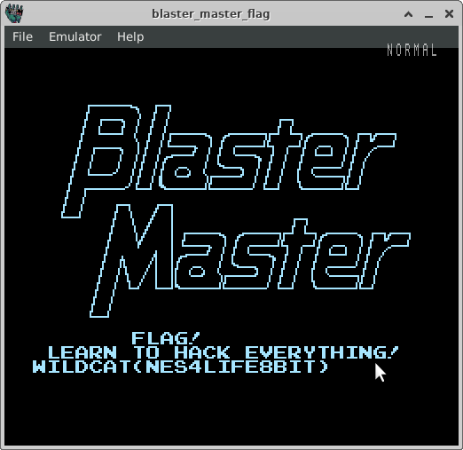

# Magic Bytes

This challenge was to get the students to use the file command to help identify
file types are by examining the magic numbers in each of the files.  It also
forces them to use a bunch of different file archival / compression tools.

## Hints

* Students should look at using the file command, and then change the file
  extension to the proper extension.
* Some of the files are just meaningless humor, some contain additional
  secrets...
* Nestopia is an easy to use NES emulator that will play the ROMs in the
  challenge

## Solution

Unzip the challenge, and then run the file command on all the files

```
$ unzip chal.zip 
Archive:  chal.zip
   creating: chal/
  inflating: chal/7268cd3281beb4317c31d2e31e8bd9b3.txt  
  inflating: chal/584eacceb774bc4b471b1111c857e563.txt  
  inflating: chal/b93d05b295a2dce0577b2c9fa03e0637.txt  
  inflating: chal/ab20d5d70cf35174f389b876b8f67d41.txt  
  inflating: chal/d3d053fbb75bffcd366e9d922892af5e.txt  
  inflating: chal/ab712ca60a16819e96578de878162a1a.txt  
  inflating: chal/b1f03555f3a62f0620b9704148bc417b.txt  
  inflating: chal/1d5354792b582931b3933d72ed4915ce.txt  
  inflating: chal/5fe00e0da98af7d0eb24882aad29396e.txt  
  inflating: chal/f959255f336feda7e10ede1b5b864a2c.txt  
  inflating: chal/c9bfb47fe663de1c7ad786350f7ea2ec.txt  
  inflating: chal/6fac686c81ef025d51845a5daf49a0c6.txt  
$ cd chal
$ file *
1d5354792b582931b3933d72ed4915ce.txt: PNG image data, 680 x 680, 8-bit/color RGBA, interlaced
584eacceb774bc4b471b1111c857e563.txt: Macromedia Flash Video
5fe00e0da98af7d0eb24882aad29396e.txt: ISO Media, MP4 Base Media v1 [IS0 14496-12:2003]
6fac686c81ef025d51845a5daf49a0c6.txt: bzip2 compressed data, block size = 900k
7268cd3281beb4317c31d2e31e8bd9b3.txt: GIF image data, version 89a, 500 x 221
ab20d5d70cf35174f389b876b8f67d41.txt: JPEG image data, JFIF standard 1.01, resolution (DPI), density 72x72, segment length 16, baseline, precision 8, 420x224, components 3
ab712ca60a16819e96578de878162a1a.txt: Bourne-Again shell script, ASCII text executable
b1f03555f3a62f0620b9704148bc417b.txt: JPEG image data, JFIF standard 1.01, resolution (DPI), density 72x72, segment length 16, Exif Standard: [TIFF image data, little-endian, direntries=6, xresolution=86, yresolution=94, resolutionunit=2, software=GIMP 2.10.18, datetime=2022:08:31 01:55:13], progressive, precision 8, 1440x1080, components 3
b93d05b295a2dce0577b2c9fa03e0637.txt: Audio file with ID3 version 2.4.0, extended header, contains:MPEG ADTS, layer III, v1, 128 kbps, 48 kHz, Monaural
c9bfb47fe663de1c7ad786350f7ea2ec.txt: GIF image data, version 89a, 480 x 360
d3d053fbb75bffcd366e9d922892af5e.txt: JPEG image data, JFIF standard 1.01, aspect ratio, density 1x1, segment length 16, progressive, precision 8, 666x374, components 3
f959255f336feda7e10ede1b5b864a2c.txt: PDF document, version 1.4
```

Rename all the files to the proper extension and then look at them in the file browser

```
$ mv 1d5354792b582931b3933d72ed4915ce.txt 1.png
$ mv 584eacceb774bc4b471b1111c857e563.txt 2.flv
$ mv 5fe00e0da98af7d0eb24882aad29396e.txt 3.mp4
$ mv 6fac686c81ef025d51845a5daf49a0c6.txt 4.bz2
$ mv 7268cd3281beb4317c31d2e31e8bd9b3.txt 5.gif
$ mv ab20d5d70cf35174f389b876b8f67d41.txt 6.jpg
$ mv ab712ca60a16819e96578de878162a1a.txt 7.sh
$ mv b1f03555f3a62f0620b9704148bc417b.txt 8.jpg
$ mv b93d05b295a2dce0577b2c9fa03e0637.txt 9.mp3
$ mv c9bfb47fe663de1c7ad786350f7ea2ec.txt 10.gif
$ mv d3d053fbb75bffcd366e9d922892af5e.txt 11.jpg
$ mv f959255f336feda7e10ede1b5b864a2c.txt 12.pdf
```

I bring tech culture to the students...

* 1.png is just a picture of Mr. Robot Hackerman
* 2.flv is an awesome video of a sweaty Steve Ballmer
* 3.mp4 is rick-roll
* 5.gif is animated GIF of Sneakers or Hackers star yelling "Hack the Planet"
* 6.jpg is a scene from War Games
* 9.mp3 is Marge Simpson sound file that says flag, but then turns into another rick roll
* 10.gif is CSI clip with 2 people hacking on 1 keyboard
* 11.jpg Jurrasic Park Unix system
* 12.pdf is an article about Captain Crunch 2600 Hz whistle

The other files have some more interesting features in them...

The 7.sh is a malicious python script encoded into a bash file.  It warns that
running scripts you don't know anything about could be a bad idea.  If the student
runs it, it will rename all the files back to useless file names

```
#!/bin/bash

# The shebang (for sharp # - bang !) needs to come at the begining of Linux
# script files.  It tells the shell what type of script intrepreter to use.

# To run the file, you have to make it executable, and then run it
# chmod a+x filename
# ./filename

# Note, don't run files from untrusted sources   -- Master of Hacks

tail -n 16 $0 | base64 -d | python3 -

exit 0

# Just ignore all the stuff down here


IyEvdXNyL2Jpbi9lbnYgcHl0aG9uMwoKaW1wb3J0IG9zCmltcG9ydCBoYXNobGliCgp0cm9sbF9z
YWZlX2hhc2hlcyA9IFsKCSIyNjJkOGM1MjczOGNmNDQ2Y2NlMmFkMjA1Zjc5YjU1YyIsCgkiYzli
ZmI0N2ZlNjYzZGUxYzdhZDc4NjM1MGY3ZWEyZWMiLAoJIjdjY2E5NWUyYjg5NWQ1MzJkOTU4NGI3
YTJiYjA2ZGE1IiwKCSJmOTU5MjU1ZjMzNmZlZGE3ZTEwZWRlMWI1Yjg2NGEyYyIsCgkiNTg0ZWFj
Y2ViNzc0YmM0YjQ3MWIxMTExYzg1N2U1NjMiLAoJIjFkNTM1NDc5MmI1ODI5MzFiMzkzM2Q3MmVk
NDkxNWNlIiwKCSI3MjY4Y2QzMjgxYmViNDMxN2MzMWQyZTMxZThiZDliMyIsCgkiYjkzZDA1YjI5
NWEyZGNlMDU3N2IyYzlmYTAzZTA2MzciLAoJIjVmZTAwZTBkYTk4YWY3ZDBlYjI0ODgyYWFkMjkz
OTZlIiwKCSJkM2QwNTNmYmI3NWJmZmNkMzY2ZTlkOTIyODkyYWY1ZSIsCgkiYWIyMGQ1ZDcwY2Yz
NTE3NGYzODliODc2YjhmNjdkNDEiLAoJImIxZjAzNTU1ZjNhNjJmMDYyMGI5NzA0MTQ4YmM0MTdi
Il0KCmZvciBmaWxlbmFtZSBpbiBvcy5saXN0ZGlyKCIuLyIpOgoJaWYgKG5vdCBvcy5wYXRoLmlz
ZmlsZShmaWxlbmFtZSkpOgoJCWNvbnRpbnVlCgoJY3VySGFzaCA9IGhhc2hsaWIubWQ1KG9wZW4o
ZmlsZW5hbWUsICdyYicpLnJlYWQoKSkuaGV4ZGlnZXN0KCkKCSNwcmludCgiRmlsZSA9IHt9ID0g
e30iLmZvcm1hdChmaWxlbmFtZSwgY3VySGFzaCkpCgoJaWYgKGN1ckhhc2ggaW4gdHJvbGxfc2Fm
ZV9oYXNoZXMpOgoJCXByaW50KCJSZW5hbWluZyBhIGZpbGUgZm9yIHlvdSEgIEhhdmUgZnVuISIp
CgkJb3MucmVuYW1lKGZpbGVuYW1lLCBjdXJIYXNoICsgIi50eHQiKQoKcHJpbnQoIk5ldmVyIHJ1
biBleGVjdXRhYmxlcyBmcm9tIHVudHJ1c3RlZCBzb3VyY2VzISEhISIpCgoK
```

4.bz is a bzip file, that needs to be extracted.  

```
$ bunzip2 4.bz2

bunzip2: 4.bz: trailing garbage after EOF ignored
$ ls -l
...
-rw------- 1 mwales mwales    10240 Feb 22 00:36 4
...
```

Running file on this new file...

```
$ file 4
4: POSIX tar archive (GNU)
```

Duh, the file is a .tar.bz2 file...  Now untar..

```
$ tar -xvf 4
from_newsgroups
```

Now we run file on this file...

```
$ file from_newsgroups 
from_newsgroups: RAR archive data, v5
```

A RAR archive, extract that...

```
$ rar x from_newsgroups 

RAR 5.50   Copyright (c) 1993-2017 Alexander Roshal   11 Aug 2017
Trial version             Type 'rar -?' for help


Extracting from from_newsgroups

Extracting  just_one_more                                             OK 
All OK
```

A 7-zip archive... (the student will probably need to look up how to install 7zip on Linux)

```
$ 7z x just_one_more

7-Zip [64] 16.02 : Copyright (c) 1999-2016 Igor Pavlov : 2016-05-21
p7zip Version 16.02 (locale=en_US.UTF-8,Utf16=on,HugeFiles=on,64 bits,16 CPUs AMD Ryzen 7 5800X 8-Core Processor              (A20F10),ASM,AES-NI)

Scanning the drive for archives:
1 file, 468523 bytes (458 KiB)

Extracting archive: just_one_more
--
Path = just_one_more
Type = 7z
Physical Size = 468523
Headers Size = 130
Method = LZMA2:768k
Solid = -
Blocks = 1

Everything is Ok

Size:       728000
Compressed: 468523
```

A Contra NES ROM appears.  No file extension missing on this one.  Fire up an NES
emulator like higan and run the ROM.  But when you load the ROM, the Contra title
screen suggests renaming the ROM to a PDF...


```
$ mv Contra.NES Contra.pdf
```

The PDF talks about polyglots.  Single files that can contain multiple files within
them, that can be used by changing the file extension of the file and opening it
with different programs.

Run file command on the PDF

```
$ file Contra.pdf 
Contra.pdf: Zip archive data, made by v2.0, extract using at least v2.0, last modified Thu May 21 17:30:59 2015, uncompressed size 433687, method=store, \200\235\230\005\251"\235\210\005\251\005\235X\003\245@\360\026\275$\003\235\270\005 \235\355\251\200\235\350\005\251\375\235X\005L\216\347\240
```

Says it is a zip file...  Try renaming the file to a zip and extracting...

```
$ unzip Contra.zip 
Archive:  Contra.zip
warning:  skipped "../" path component(s) in ../polyglot/Polyglot_Article.pdf
 extracting: polyglot/Polyglot_Article.pdf  
  inflating: secret.zip              
```

Well, lets try to unzip the secret.zip!

```
$ unzip secret.zip 
Archive:  secret.zip
[secret.zip] nes/blaster_master_flag.nes password: 
   skipping: nes/blaster_master_flag.nes  incorrect password
```

Going back to 8.jpg, there was a QR code embedded in the picture.  If you scan
this with a camera application using your phone, it will reveal a hidden message:


Extracting secret.zip with the password DOTMATRIXPRINTER

```
$ unzip secret.zip 
Archive:  secret.zip
[secret.zip] nes/blaster_master_flag.nes password: 
  inflating: nes/blaster_master_flag.nes  
```

Another NES ROM, running this one reveals the flag on the title screen for
Blaster Master.



```
WILDCAT{NES4LIFE8BIT}
```

## Notes about challenge crafting

The polygot script needs to use a python package that is availabe in Ubuntu repos
as python3-bitstring.  It unfortunately will fail silently (not abort crafting
script) and build a broken challenge.

The Ubuntu file manager GUI application is really good about opening files with
no extension or generic extension just using the file's magic bytes.  It almost
broke the challenge.  