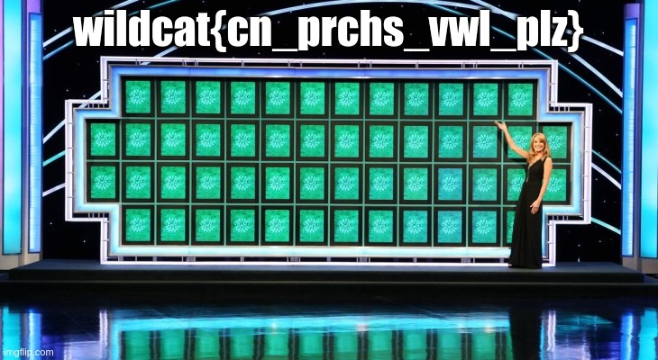

# Null Cipher 2

Continuation of the problem from the Null Cipher challenge.  Just added in the
ability to use upper and lower case text, and not alphabetic characters.

## Hints

* Users can use lower() or upper() functions in the tests for a character, but
  should take care not to change the case of the plaintext inadvertently
  because flags are case sensitive

* Hopefully the kids saw the presentation that talked about base64 encoding

* Don't decode base64 encoded data to standard output / the terminal screen.
  It's often binary data that will have non-printable characters, and will
  likely screw up the shell.

## Sample Code Solution

```
#!/usr/bin/env python3                             
                                                           
import sys                                    
                                                           
if (len(sys.argv) != 2):                  
        print("Usage: {} filename.txt".format(sys.argv[0])) 
        print("  Use - instead of a filename to read from stdin")       
        print("  First line is the number of lines in the data set")    
        sys.exit(1)                                   
                                                           
if (sys.argv[1] == "-"):
        data = sys.stdin.read()   
else:                    
        f = open(sys.argv[1], 'r')
        data = f.read()
        f.close()
                                                                                                                       
inputlines = data.split('\n')
numLines = int(inputlines[0])

for singleLine in inputlines[1:1 + numLines]:
        outputNextChar = False
        outputLine = ""

        for singleChar in singleLine:
                if (outputNextChar):
                        # Previous char was a vowel
                        outputLine += singleChar
                        outputNextChar = False
                else:
                        # Check for vowels
                        justLower = singleChar.lower()
                        if ( (justLower == 'a') or (justLower == 'e') or
                             (justLower == 'i') or (justLower == 'o') or
                                 (justLower == 'u') ):
                                 outputNextChar = True

        # Finished processing line
        print(outputLine)
```

## Solution

```
$ ./solution.py ciphertext2.txt | head
/9j/4AAQSkZJRgABAQAAAQABAAD/2wBDAAMCAgICAgMCAgIDAwMDBAYEBAQEBAgGBgUGCQgKCgkI
CQkKDA8MCgsOCwkJDRENDg8QEBEQCgwSExIQEw8QEBD/2wBDAQMDAwQDBAgEBAgQCwkLEBAQEBAQ
EBAQEBAQEBAQEBAQEBAQEBAQEBAQEBAQEBAQEBAQEBAQEBAQEBAQEBAQEBD/wgARCAGQAtoDASIA
AhEBAxEB/8QAHQAAAgEFAQEAAAAAAAAAAAAABgcFAAIDBAgBCf/EABsBAAEFAQEAAAAAAAAAAAAA
AAABAgMEBgUH/9oADAMBAAIQAxAAAAErl9Ce23mEEnXckZemzVWbAtzeJK263z1KqqYVVUpVUSKg
3JPE+QU5aRLCeGLXMm0kEmWPfl1obYwex8ctFeVBaqqJGOhNY1Cgquqk8C2qqCqu8U8qbY0saerp
...
```

Lots of base64 text is dumped on the screen, over 1,700 lines of it.  Decode
this data into a file

```
$ ./solution.py ciphertext2.txt | base64 -d > flag.bin
```

What is this file that we have created?

```
$ file flag.bin
flag.bin: JPEG image data, JFIF standard 1.01, aspect ratio, density 1x1, segment length 16, progressive, precision 8, 730x400, components 3
```

It's a JPEG image.  If you just browse to this folder, Ubuntu will likely just
automatically display the file without the proper extenstion, but if not rename
the file using the proper extension.

```
$ mv flag.bin flag.jpg
```

And you can now see the flag



