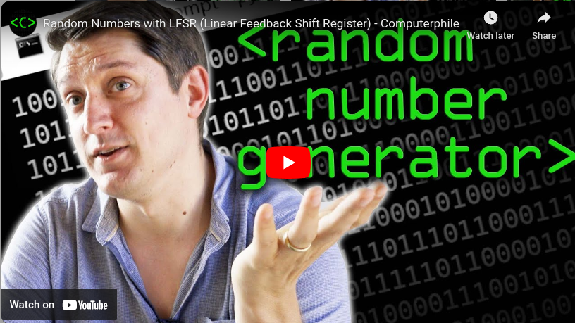

Name: Star Wars: Prequels
Category:  Cryptography

Attachments:
* [battle.py](battle.py) : This is the main file to analyze
* [pictures.ans](pictures.ans) : Just put this file in the same directory as battle.py
* [flag.txt](flag.txt) : You wouldn't have this file for the real challenge when it's online

Message:

Creating random unpredictable numbers on a computer can be very problematic.
Pseudo Random Number Generators (PRNG) have a state.  They can output a
random number as transition to their next state.  This video demonstrates
how many old computers created random numbers using a Linear Feedback Shift
Register (LFSR).

If at any point during a program's execution, you are able to determine the
current state of the PRNG, you will be able to predict future values
generated by the PRNG.

So to make a program give unpredictable random numbers, you have to make
sure the user can't figure out the state of the PRNG.

Think about what would happen if the Lottery numbers were picked by a
computer and someone could predict what numbers were going to appear!

To get the flag for this challenge, you need to predict the winner of my Star
Wars battle game 7 times in a row!

Connect to my battle game at the following port:

The challenge was hosted online, but now you can try it out by running battle.py locally on your own machine. 

[ Solution Write-up ](prequel_writeup.md)

