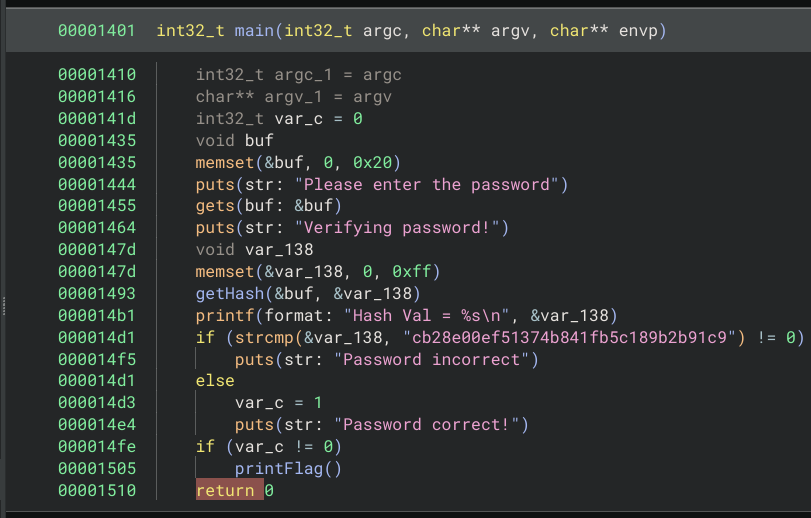
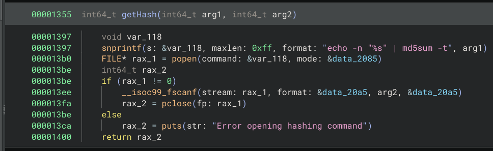
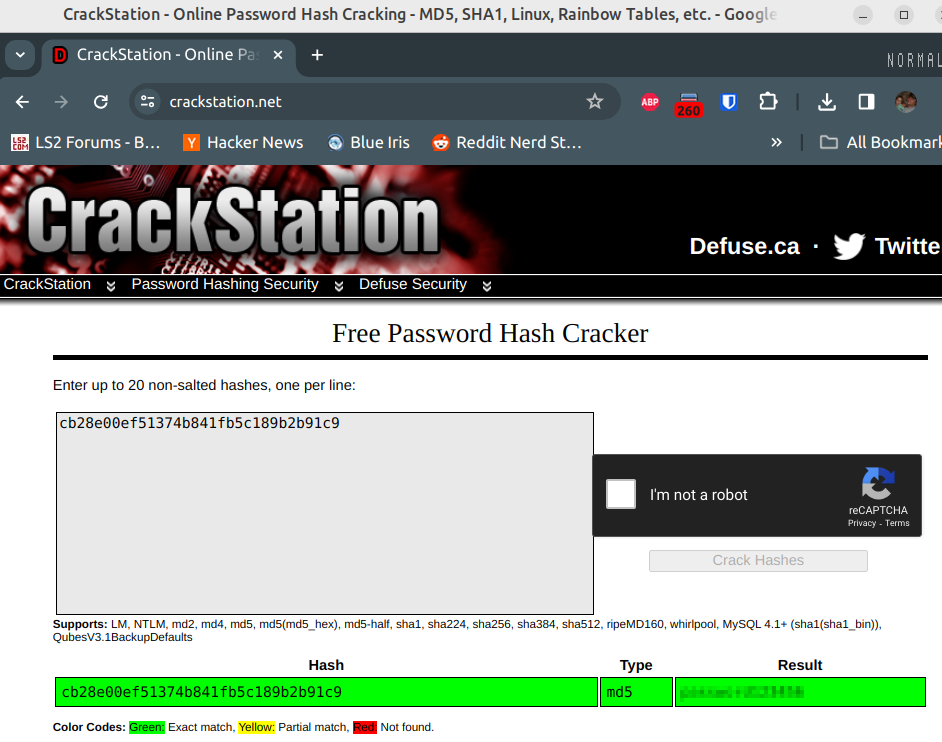
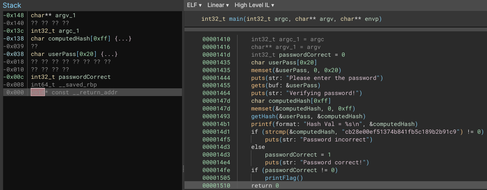

# Partial Writeup - Password Check

Very happy with this challenge cause there were many fun ways to solve!

Opening the binary in BinaryNinja and looking around the main function:

Main function:



Main calls a function called getHash:



For the first part of the challenge, we are just trying to get the flag.  There
is a printFlag function that is called that will print the flag if we know the
password.

## Hash Crack Method

If you look at how the hash is computed, it's a call to md5sum where the
the password is sent to it on stdin from an echo command.  The hash is then
checked to see if it is cb28e00ef51374b841fb5c189b2b91c9.

Can we crack that hash?

Turns out there is a little website that can crack MD5s (I'm assuming use
rainbow tables, cause it was really fast).



I tried to get john to crack it, but I wasn't able to easily get a version of
john that had raw-md5 mode in it.  If you compile jumbo-john from source it
should come with that mode, and that may be able to crack it.

The last cracking tool I tried was hashcat.

```
sudo apt-get install hashcat hashcat-data hashcat-nvidia
```

I also downloaded the rockyou.txt password database.

I put the hash in file, and ran hashcat on it.

```
$ cat hash.txt                                            
cb28e00ef51374b841fb5c189b2b91c9                                                                                                             
$ hashcat hash.txt                                        
hashcat (v6.2.5) starting in autodetect mode
                                                                      
Successfully initialized NVIDIA CUDA library.


The following 11 hash-modes match the structure of your input hash:

      # | Name                                                | Category
  ======+=====================================================+======================================
    900 | MD4                                                 | Raw Hash
      0 | MD5                                                 | Raw Hash
     70 | md5(utf16le($pass))                                 | Raw Hash
   2600 | md5(md5($pass))                                     | Raw Hash salted and/or iterated
   3500 | md5(md5(md5($pass)))                                | Raw Hash salted and/or iterated
   4400 | md5(sha1($pass))                                    | Raw Hash salted and/or iterated
  20900 | md5(sha1($pass).md5($pass).sha1($pass))             | Raw Hash salted and/or iterated
   4300 | md5(strtoupper(md5($pass)))                         | Raw Hash salted and/or iterated
   1000 | NTLM                                                | Operating System
   9900 | Radmin2                                             | Operating System
   8600 | Lotus Notes/Domino 5                                | Enterprise Application Software (EAS)

Please specify the hash-mode with -m [hash-mode].
```

It looks like we want mode 0.

If we run hashcat --help, we see some information about attack modes.  I
eventually end up trying to run a dictionary attack using the rockyou.txt
password database.

```
$ hashcat -m0 -a0 hash.txt rockyou.txt 
...
Dictionary cache built:
* Filename..: rockyou.txt
* Passwords.: 14344394
* Bytes.....: 139921525
* Keyspace..: 14344387
* Runtime...: 0 secs

cb28e00ef51374b841fb5c189b2b91c9:[REDACTED]
                                                          
Session..........: hashcat
Status...........: Cracked
Hash.Mode........: 0 (MD5)
Hash.Target......: cb28e00ef51374b841fb5c189b2b91c9
Time.Started.....: Fri Jan 26 01:38:00 2024 (0 secs)
Time.Estimated...: Fri Jan 26 01:38:00 2024 (0 secs)
Kernel.Feature...: Pure Kernel
Guess.Base.......: File (rockyou.txt)
Guess.Queue......: 1/1 (100.00%)
Speed.#1.........:   105.1 MH/s (3.70ms) @ Accel:2048 Loops:1 Thr:32 Vec:1
Recovered........: 1/1 (100.00%) Digests
Progress.........: 2490368/14344387 (17.36%)
Rejected.........: 0/2490368 (0.00%)
Restore.Point....: 0/14344387 (0.00%)
Restore.Sub.#1...: Salt:0 Amplifier:0-1 Iteration:0-1
Candidate.Engine.: Device Generator
Candidates.#1....: 123456 -> zoeemma2007
Hardware.Mon.#1..: Temp: 47c Fan:  0% Util: 29% Core:2010MHz Mem:6800MHz Bus:16
```

## Simple Buffer Overflow method

After doing some variable naming and typing in Binary Ninja, I got the
following looking pseudo-C.



The use of gets function is automatic red-flag.  From the gets manpage:

```
GETS(3)                                                                                                                      Linux Programmer's Manual                                                                                                                     GETS(3)

NAME
       gets - get a string from standard input (DEPRECATED)

SYNOPSIS
       #include <stdio.h>

       char *gets(char *s);

DESCRIPTION
       Never use this function.

       gets() reads a line from stdin into the buffer pointed to by s until either a terminating newline or EOF, which it replaces with a null byte ('\0').  No check for buffer overrun is performed (see BUGS below).

```

Yep, it actually underlines __Never use this function__.  So the gets will
easily overflow the userPass variable on the stack.  And After the userPass
variable, there is 12 bytes of padding, and then the flag for the password
being correct.  If we write a password that is 45-48 characters long, we
should corrupt the local state variable on the stack, and cause the main
function to print the flag for us.

```
$ ./a.out 
Please enter the password
aaaaaaaaaaa....  [REDCATED]
Verifying password!
Hash Val = d1e358e6e3b707282cdd06e919f7e08c
Password incorrect
Flag: [REDACTED]
```

You might be able to even overwrite the return pointer for the function, and
call printFlag directly, but that is a bit more work that required.

## Command Injection


The code for computing the md5hash sends the password via echo to md5sum, and
it captures the ouput from the md5sum application using popen().  Popen() is
vulnerable to command injection attacks much like system().  The output from
echo where we have command injection gets hashed though, so we need to inject
a comment character or else get our output from shell command hashed.

So I want to inject the following:

* A end quote for the quote that echo starte for the password
* A semicolon to add an extra command between echo and the pipe.
* cat flag.txt to output the flag
* A comment to prevent the piping of data to md5sum

Here is what that looks like:

```
$ ./a.out 
Please enter the password
[REDACTED]
Verifying password!
Hash Val = wildcat{[REDACTED]}
Password incorrect
```

# Password checker flag 2

Inject /bin/sh into the command.  You won't get to see any output which is
annoying unless you comment after the injection.  Also, you can only get 1
word of ouput because of scanf.

I ended up doing a directory listing and piping to base64.  That gave me
a single long base64 string of the directory listing.

[REDACTED]

