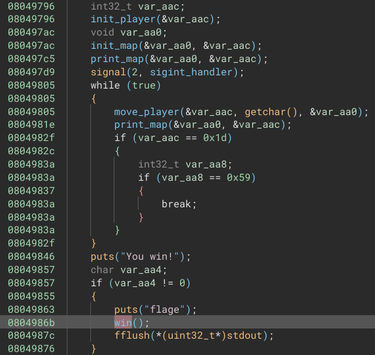
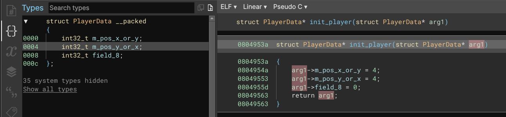
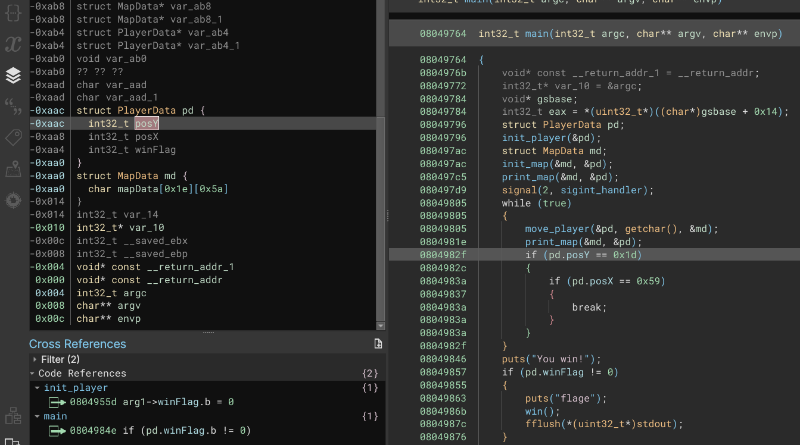

# Solution - Pwn Game

Opened the application in Binary Ninja to start reversing it.  Went to the main
function we see reference to a player, a map, a move_player function, and a
conditional path that looks like it will reveal the flag.

Playing around with the game a little bit, and looking inside the move_player
function reveals the control scheme for the game.  The move function is looking
for typical WSAD inputs, and the 'l' and 'p' seem to have special functions.
The 'p' input seems to warp the player to the end square.

Back to reversing for a bit...

The init_player function seems to be passed an pointer to a structure with 3
members.  We will assume this is player data.  2 of the fields are likely the
x and y position of the player.  The last field is unknown.

In the main function, we can now assign the PlayerData structure to one of the
local stack variables. We can also see that init_map takes a pointer to an
unknown structure, and a pointer to the PlayerData structure we just created.

Inside the init_map function we see 2 loops.  This appears to set every square
of the map to a . character, or a player_tile character.  The game board was
much wilder than it was tall, so we can determine which loop is the y coord, 
and which loop is the x coord.

After putting all the structures in, naming the fields, and then updating the
types in the main function, the main function will start to look like the
following:

You can also see that the game prints out that status of the variable guarding
the flag with the print_flag_status function.  The most direct way for me to
win the game appears to try to traverse out of the game board into other stack
variables.  Since the PlayerData is ontop of the MapData in the stack view, we
have to find out a way to traverse up into the PlayerData from moving around
on the map screen.

I figured if I go to a negative y value, near the right side... [REST OF WRITEUP REDACTED]

