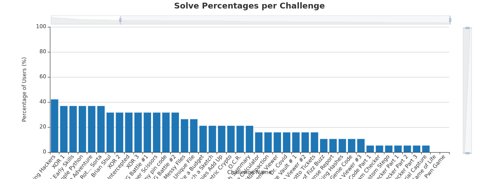
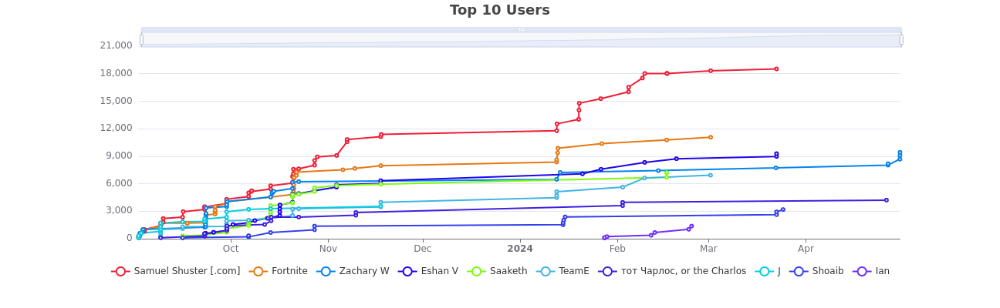
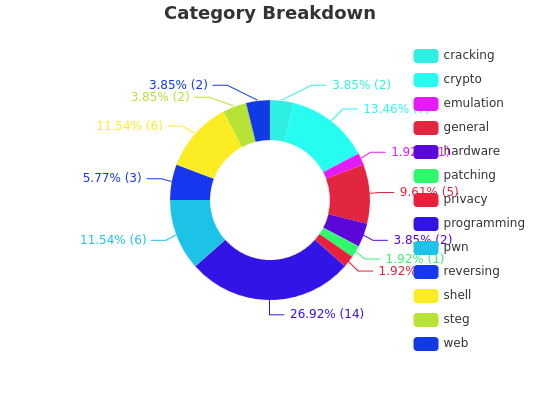

# Wildcat CTF 2023-2024

Our second year of CTF based Computer Science club has concluded.  Students
were presented 52 challenges over the year, and only 2 challenges remained
unsolved at the end of the year.

Congratulations to our seniors Gabby and Dominick.  Good luck at college!

## Final Standings

| Place | Student                | Score |
|-------|------------------------|-------|
| 1st   | Sam S                  | 18522 |
| 2nd   | Parker W               | 11065 |
| 3rd   | Zachary W              | 9425  |
| 4th   | Eshan V                | 9275  |
| 5th   | Saaketh K              | 7200  |
| 6th   | Gabby Z and Dominick M | 6925  |
| 7th   | Charles                | 4210  |
| 8th   | Jay J                  | 3525  |
| 9th   | Shoaib                 | 3175  |
| 10th  | Ian                    | 1375  |
| 11th  | Mili                   | 975   |
| 12th  | Raaha                  | 975   |
| 13th  | Faizan                 | 750   |

## Challenge Highlights

Some of the challenges that are posted are just borrowed from other
CTF or challenges.  Those included the following this year:

* picoCTF Early Skills, piocCTF Simple Python, and Pwn Game were challenges or
  collection of challenges from picoCTF
* Pennies Add Up, Make a Budget, Airport Expense Code, Detecting Multipaction,
  Ship Health Summary, Anagram Checker, Fizz Buzz, and Game of Life were all
  challenges from Lockheed Martin's Code Quest
* IntCode Part 1: Advent of Code

We hacked some of my favorite NES games in Jackal, Dr. Covid (Dr. Mario), and
Game Genie Code (R.C. Pro-Am).

Sam S. created some web challenges for the other students to solve: Sam's Custom
Stego, Request Intercepted, and Rock Paper Scissors.

We played some old-school text based adventure games and got to see some ASCII
art, decoded octal numbers, crypto, pwn-ing, and cracking:

See everyone next year!