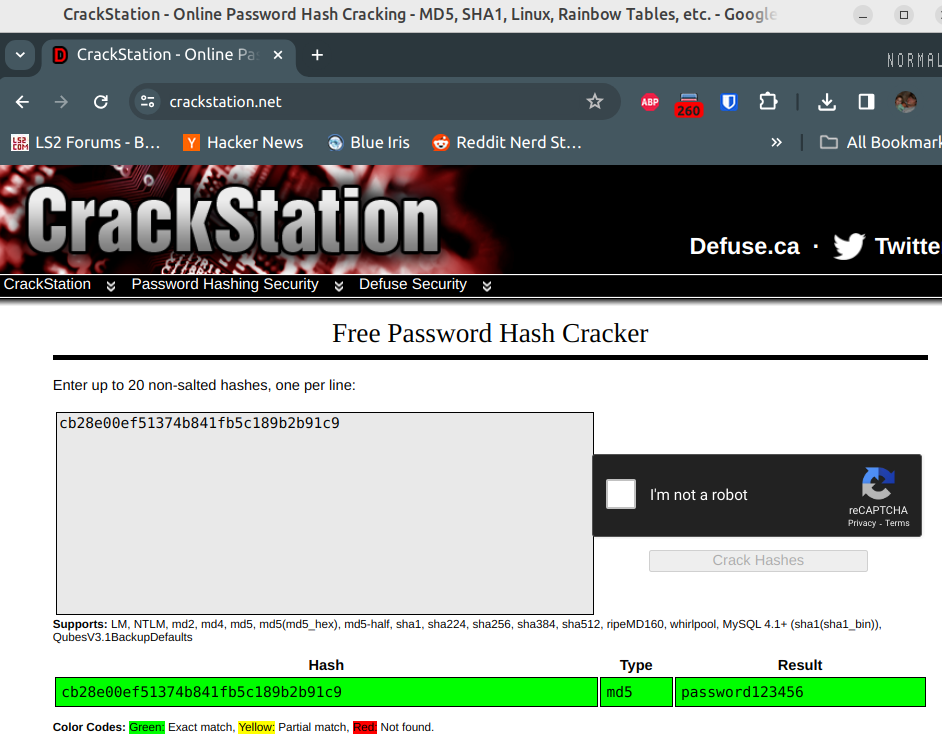

# Partial Solution - Rocking Hashes

The challenge text given to you looks like 3 md5 hashes (based on the length
of the hash, and the hint given to you).

```
wildcat{72340ede7deeba250b290906090b4587_793161ba475a30b7f2cebeba189a6f9f_0d79c4a8bb78a74c6b5ecfaf8a523ee3}
```

Given the name of the challenge, and the "Did it RockYou.txt" clue in the challenge description,
you should try to google RockYou.txt.  Or read [Understanding RockYout.txt: A Tool for Security
and a Weapon for Hackers](https://www.keepersecurity.com/blog/2023/08/04/understanding-rockyou-txt-a-tool-for-security-and-a-weapon-for-hackers/).
RockYou.txt is an industry standard real-world password list of 32 million passowrds.

The hashes probably match the hashes of one of the passwords in RockYou.txt.  So we need a
tool that can compute all the hashes of RockYou.txt search them for us.

I wrote my own rainbow table creation tool using rockyou, and then could look
up the hashes in the precomputed table.

```
$ ./convert_passes_to_hashes.py ry.txt asdf
Time to hash 14336803 was 8.697188138961792 seconds
('e10adc3949ba59abbe56e057f20f883e', '123456')
('827ccb0eea8a706c4c34a16891f84e7b', '12345')
('25f9e794323b453885f5181f1b624d0b', '123456789')
('5f4dcc3b5aa765d61d8327deb882cf99', 'password')
('f25a2fc72690b780b2a14e140ef6a9e0', 'iloveyou')
Time to reorder is 3.6543116569519043 seconds
Give me a hash to lookup
72340ede7deeba250b290906090b4587
[REDACTED]
Give me a hash to lookup
793161ba475a30b7f2cebeba189a6f9f
[REDACTED]
Give me a hash to lookup
0d79c4a8bb78a74c6b5ecfaf8a523ee3
[REDACTED]
Give me a hash to lookup
```

There is also an online website that can look up unsalted hashes in a rainbow
table that is has generated from an extensive password dump list.



Which putting these values back into the flag reveals...
