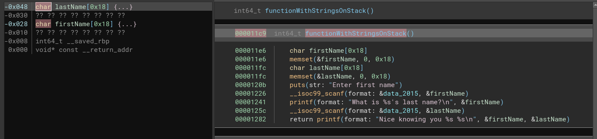
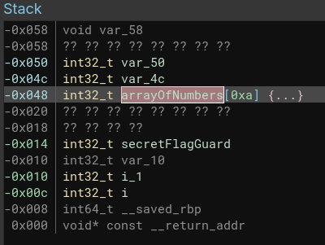

# Stack Buffer Overflow

Stack buffer overflow is a bug where there is a local variable or array (on the
stack) that when the program goes to write to the variable, it writes outside
of the memory reserved for the local variable or array.  This can corrupt other
variables or data on the stack, and commonly leads to a code execution exploits.

## String Buffer Example

Lets look at some example C with some stack variables:

```
void functionWithStringsOnStack()
{
	char lastName[0x18];
	char firstName[0x18];

	memset(firstName, 0, 0x18);
	memset(lastName, 0, 0x18);

	printf("Enter first name\n");
	scanf("%s", firstName);

	printf("What is %s's last name?\n", firstName);
	scanf("%s", lastName);

	printf("Nice knowing you %s %s\n", firstName, lastName);
}
```

After naming and typing some of the variables in Binary Ninja, it gives us
a great view of where data is being stored on the stack.



The left pane is the stack.  The lastName is 0x18 bytes long, there is some
padding of 0x8 bytes between the 2 variables, and then then comes the first
name, followed by a saved base pointer address, and return address for this
function call.

Normal run of the program looks like the following:

```
Enter first name
Michael
What is Michael's last name?
Wales
Nice knowing you Michael Wales
```

But notice what happens if we make a really really long last name.  If you
overflow the buffer used for the last name, you can corrupt where the first
name is stored!

```
Michael
What is Michael's last name?
Wales!!!!!!!!!!!!!!!!!!!!!!!!!!!Bro
Nice knowing you Bro Wales!!!!!!!!!!!!!!!!!!!!!!!!!!!Bro
```

The string "Wales!!!!!!!!!!!!!!!!!!!!!!!!!!!" is exactly 0x20 characters long
and fills up all the stack memory for the last name and the padding between
the two variables.  We then overwrite the first name with Bro.  We don't get
to see the ending of the first name "hael" because after Bro, a null character
was written ending where the first name string.

This buffer overflow becomes even more powerful that just first name corruption
if a really long name is used.  Because the return address of the function can
be overwritten, and will cause a program crash, or undesired code to execute.

## Integer Array Example

Here is an example of some code that has an array of integers stored on the
stack.

```

```

You can normally change a value in the list, and print the list out as follows:

```
Menu:
 (1) Print list
 (2) Set a value
 (3) Exit
1
0 0 0 0 0 0 0 0 0 0 
Menu:
 (1) Print list
 (2) Set a value
 (3) Exit
2
Which index?
3
33
Set index 3 to 33
Menu:
 (1) Print list
 (2) Set a value
 (3) Exit
1
0 0 0 33 0 0 0 0 0 0 
Menu:
 (1) Print list
 (2) Set a value
 (3) Exit
3
```

But since the index that we provide is not checked, we can cause the program
to write well outside of the bounds of the array onto other stack variables.

After naming and typing the relevant variables that are on the stack in Binary
Ninja, the stack view will look like the following:



We can calculate the offset of the that we need to overwrite to change the 
stack variable guarding the secret. (0x48 - 0x14) / 0x4 = 13.  We divide by 4
because that is the length of each integer stored in the array.

If we overwrite the index 13, we will actually be overwriting the guard
variable for the secret, and can then cause the secret to be revealed!

```
Menu:
 (1) Print list
 (2) Set a value
 (3) Exit
1
0 0 0 0 0 0 0 0 0 0 
Menu:
 (1) Print list
 (2) Set a value
 (3) Exit
2
Which index?
13
1
Set index 13 to 1
Menu:
 (1) Print list
 (2) Set a value
 (3) Exit
1
0 0 0 0 0 0 0 0 0 0 
Menu:
 (1) Print list
 (2) Set a value
 (3) Exit
3
Reveal the secret!
```

# Real World Example

In the book "A Bug Hunters Diary", the popular VLC player had a buffer overflow
vulnerability in the TiVo movie decoder.  At one point in the parsing of the
video stream, a length of the chunk of the next data chunk was stored in the
file.  The decoder reads this length (lets say x bytes), and then reads x
number of bytes of the next data chunk into a stack buffer.  But if the video
file has a chunk size longer than the code expects, you can crash or exploit
VLC Video player.

# Mitigations

* Verify writes to a stack variable won't exceed the bounds of the variable
* Turn on stack cookies (compiler option, on by default in GCC)

